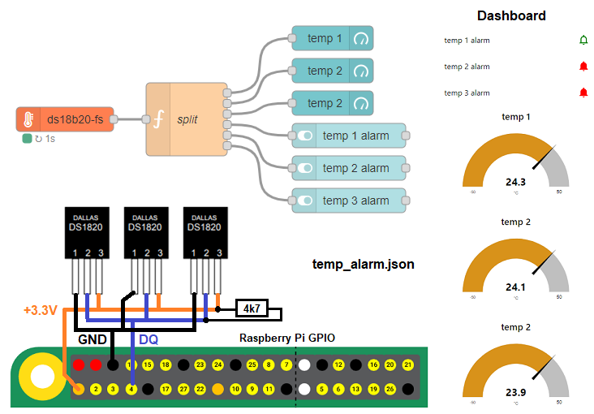

# node-red-contrib-iiot-rpi-ds18b20

[](https://nodered.org)
[](https://www.raspberrypi.com/)


[](https://www.paypal.com/cgi-bin/webscr?cmd=_s-xclick&hosted_button_id=ZDRCZBQFWV3A6)

A Node-RED node for multiple ds18b20 digital temperature sensor<br>

## Installation
Install with Node-Red Palette Manager or npm command:
```
cd ~/.node-red
npm install node-red-contrib-iiot-rpi-ds18b20
```

## Usage
- Multiple sensors are read on cycle.
- To prevents locks only one node is allowed.
- The output values are °C or °F and send as number array.
- This node works on Raspberry Pi with 32bit or 64bit OS.
- Enable 1-Wire with raspi-config.

[CHANGELOG](CHANGELOG.md)

## Example
This example reads temperatures from 3 sensors.<br>
Values are in °C.<br>
Each sensor value is send to outputs 0..2 in function node.<br>
In Node-Red Dashboard, these are displayed in gauges.<br>
Each sensor value is compared with fix value and send to outputs 3..5 in function node.<br>
In Node-Red Dashboard, these are displayed in sliders as alarm.<br>

### JavaScript Code in Function Node:
```javascript
return [
    { payload: msg.payload[0] }, // output 1
    { payload: msg.payload[1] }, // output 2
    { payload: msg.payload[2] }, // output 3  
    { payload: msg.payload[0] >= 30.5 }, // output 4
    { payload: msg.payload[1] >= 20.5 }, // output 5
    { payload: msg.payload[2] >= 19.3 } // output 6  
];
```



